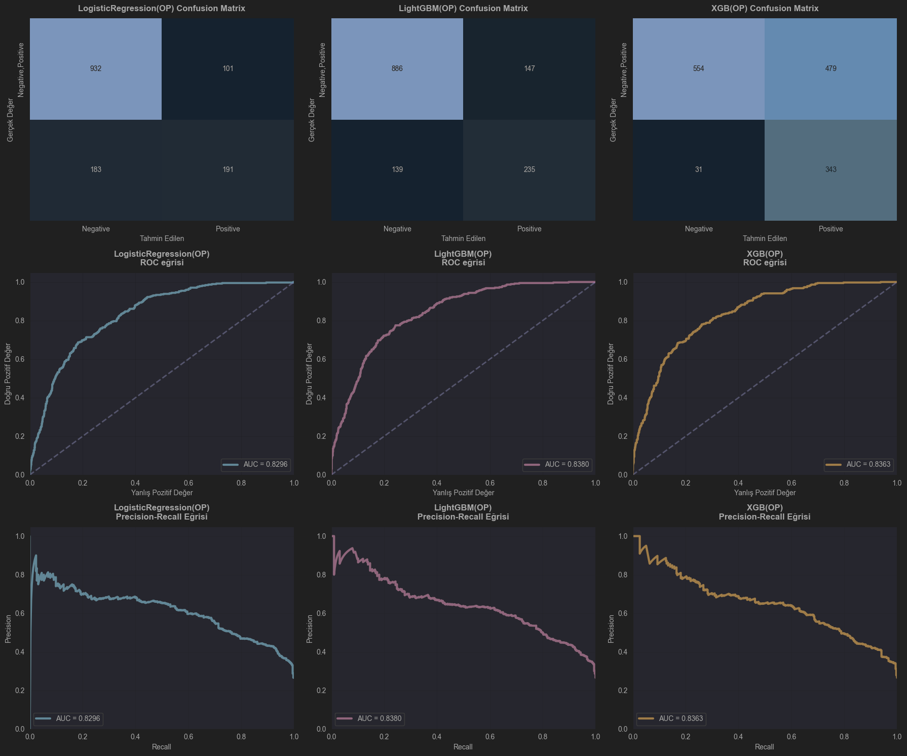
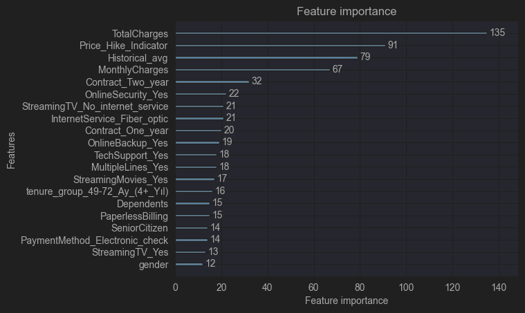
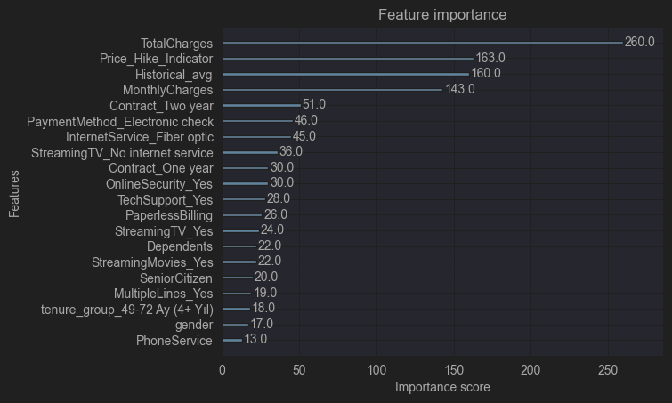
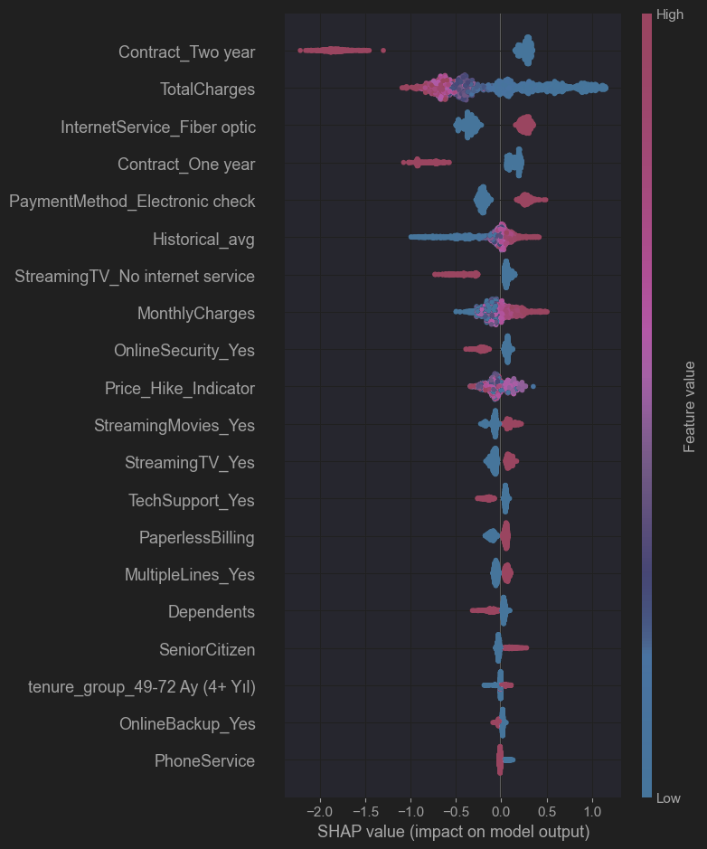
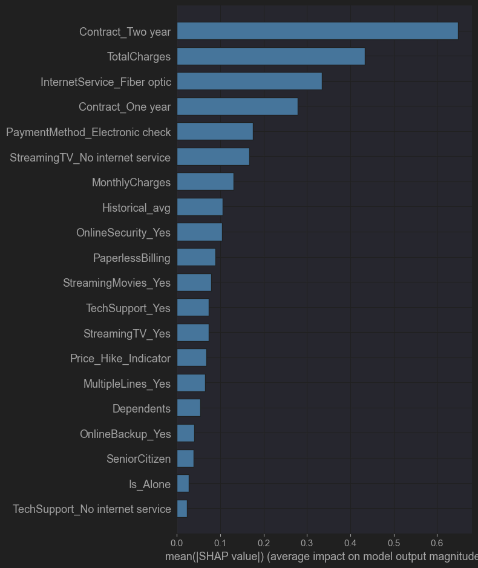

## Telekom Müşteri Ayrılma Tahmini

### Veri Kaynağı:
 https://www.kaggle.com/datasets/blastchar/telco-customer-churn?utm_source

### İçerik:

telekom_churn.ipynb 

data/ — (opsiyonel) kullanılacak ham/veri dosyaları (.csv)

README.md — Bu dosya

### Kurulum:

Repo'yu klonla (veya notebook dosyasını bulunduğun yere kopyala):

     git clone <REPO_URL>
      cd <repo_klasoru>

Sanal ortam oluştur (conda veya venv önerilir):

#### conda örneği
     conda create -n churn python=3.10 -y
     conda activate churn

#### veya venv örneği
    python -m venv .venv
#### Windows PowerShell
    .\.venv\Scripts\Activate.ps1
#### Git Bash / Linux / Mac
    source .venv/bin/activate

Gereksinimleri yükle:

     pip install (pandas, numpy, scikit-learn, 
     xgboost, lightgbm, 
     shap, matplotlib, seaborn, optuna, jupyterlab)

### Kullanım 
  
Jupyter Notebook'u başlat:

    jupyter notebook
####  veya
    jupyter lab

telekom_churn.ipynb dosyasını aç ve hücreleri sırayla çalıştır.

Veri yolu/namespaces farklıysa notebook içindeki data_path değişkenini güncelle.

#### Hızlı Çalıştırma (script olarak)

Notebook'u script'e dönüştürüp çalıştırmak istersen:

    jupyter nbconvert --to script "telekom_churn.ipynb"
    python "telekom_churn.py"

(Not: Notebook'tan script üretildiğinde bazı interaktif hücreler eksik çalışabilir.)

### Metrikler ve Değerlendirme

Proje ana metriği: ROC-AUC (ayrıştırma kabiliyeti)Ek metrikler: Precision, Recall, F1-score, Accuracy, Confusion Matrix

📊 Metrik Tablosu

Aşağıdaki tabloda modellerin K-Fold Cross Validation sonuçları yer almaktadır:

| Model                  | Accuracy         | Recall           | Precision        | F1-Score         | ROC-AUC          | Eğitim Süresi |
| ---------------------- | ---------------- | ---------------- | ---------------- | ---------------- | ---------------- | ------------- |
| **LogisticRegression** | 0.7506 (±0.0073) | 0.7906 (±0.0155) | 0.5204 (±0.0093) | 0.6276 (±0.0086) | 0.8438 (±0.0074) | 0.05s         |
| **LightGBM**           | 0.7723 (±0.0077) | 0.7191 (±0.0157) | 0.5553 (±0.0111) | 0.6266 (±0.0130) | 0.8381 (±0.0050) | 0.71s         |
| **RandomForest**       | 0.7932 (±0.0079) | 0.4823 (±0.0315) | 0.6492 (±0.0155) | 0.5531 (±0.0248) | 0.8289 (±0.0083) | 0.83s         |
| **XGBoost**            | 0.7735 (±0.0086) | 0.6448 (±0.0185) | 0.5647 (±0.0143) | 0.6021 (±0.0155) | 0.8258 (±0.0055) | 0.56s         |

📊 ÖZET TABLO – OPTİMİZASYON ÖNCE vs SONRA 

| Model                  | Optimizasyon Öncesi ROC-AUC | Optimizasyon Sonrası ROC-AUC | Değişim     | Açıklama                          |
| ---------------------- | --------------------------- | ---------------------------- | ----------- | --------------------------------- |
| **XGBoost**            | 0.8258                      | 0.8474                       | **+0.0216** | Optuna tuning ile önemli iyileşme |
| **LightGBM**           | 0.8381                      | 0.8474                       | **+0.0093** | Stabil fakat anlamlı artış        |
| **Lojistik Regresyon** | 0.8438                      | 0.8435                       | −0.0003     | Aynı seviyede, minimal düşüş      |

### Görseller

